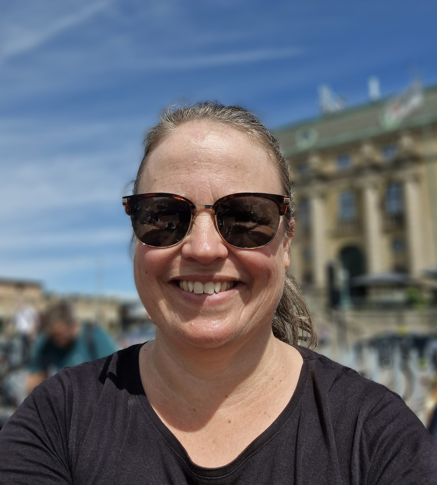

# PORTFOLIO-MarieJonsson
 
# Hej!              
 
 
## Marie Jönsson
 Jag är snart utbildad Pythonutvecklare inom Maskininlärning och AI efter att ha jobbat 22 år som ingenjör inom Automotive. 

## Under utbildningen har jag lärt mig
- Programmering i Python: *fundamentals*, *OOP*
- Databehandling: *datakombinering och -aggregering, hantera saknad data, dimensionsreducering och data cleaning*, *pandas*, *numpy*, *anonymisering av data (GDPR)*
- Linjär algebra 
- Statistiska metoder: *Vanliga fördelningar, korrelation, kovarians, väntevärde, estimering och skattning, hypotestestning och regressionsanalys med NumPy, SciPy och Statsmodels*
- Maskininlärning: *Linear- and logistic regression* , *K Nearest Neighbours (KNN)*, *Support Vecor Machine (SVM)*, *Classification and regression trees*, 
*Random Forest Classifier*, *NaiveBayes*, *Principal Component Analysis (PCA)*, *NLP-intro*

- Deep learning: *Multilayer Perceptron MPL - image recognition, regression, classification*, *Convolutional Neural Networks (CNN)*, *Data Augument*, *Transfer learning*, *Text preprocessing*
  
- Databaser: *MS SQL*

- Data engineering och Agila metoder: *Data engineeringkoncept som data pipelines, data processing i Azure*

- Visualiseringsverktyg: *Seaborn*, *Plotly*, *Matplotlib* , *mfl*
- Git/GitHub, pip / pipenv, Markdown. 	
